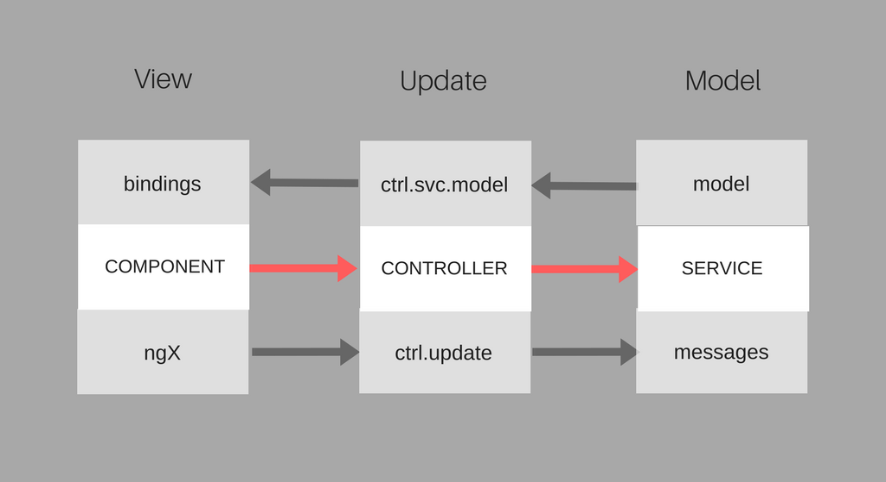

# ng-elemental
AngularJS application pattern for unidirectional flow and predictable state container, inspired by [Elm](https://www.gitbook.com/book/evancz/an-introduction-to-elm/details) and [Flux](https://facebook.github.io/flux/).

## Complexity
AngularJS feels like a collection of features and tools accumulated over time than a well-designed framework. Some of the issues have been unnecessarily complicate in AngularJS were:
+ unrestricted immutability surface
+ bidirectional data flow
+ lack of clear lines between controllers and services 
+ ubiquitous mutation of state within injected services from any controller

Some of these has a lot to do with Javascript than AngularJS.

## Model-update-view
This is an opinionated pattern and not a framework, module, or even a rule. This can appear as an anti-pattern to Javascript and Angular programmers, considering coming from myself with limited experience in AngularJS and Javascript (but with a fresh bias of wanting to improve how I work with them).

With that in mind, here is a few things I would refactor going forward with AngularJS. This pattern is heavily influenced by the Elm architecture (which had also inspired Redux). 

### Model 
+ A service should act as a store or a state container, and should always coupled by a controller instead of trying to provide its owner API.
+ A service’s constructor must return a closure instead of setting its internal state in a constructor so it can be injected with starting model state and messages option.
+ A service’s state should only be updated via an `update` function.

```javascript

// ES6 class

class MyStoreService {
  constructor () {
    return (initState, messageOpts) => {
      this.model = initState;
      this.messages = MessageOpts;
      return this;
    }
  }
}

// or

function MyStoreService () {
   return (initState, messageOpts) => {
     return {
       model: initState,
       messages: messageOpts
     }
   }
}

app.module("services", []).service("myStoreService", MyStoreServce);

```

Returning a closure instead of having a service being initiated implicitly is easier to test as well as encourages delegating the task of initiating the state to some other entity. This is an example of a controller initiating a store locally, but it could have fetched a starting state from another service:

```javascript

function MyStoreController (myStoreService) {

  let model = { 
    name: "", 
    age: 0 
  };
  let messages = {};
  
  // Initiating a myStore service
  this.store = myStoreService(model, messages);
}

```

### Update
+ The controller initiates the starting model state and messages mapping (or use another service to fetch the data, possibly via `$http`) by injecting them into its service’s constructor. 
+ The controller contains only one function, namely `update` (it can be any name), which sends an appropriate message string to call an associated pure function in the `messageOpts` (as seen in the above code), an object mapping messages to functions. 

Here is what an update function may look like:

```javascript

function MyStoreController (myStoreService) {

  let model = { 
    name: "", 
    age: 0 
  };
  let messages = {
    SetName: (model, newName) => {
      return Object.assign(model, {name: newName});
    },
    SetAge: (model, newAge) => {
      return Object.assign(model, {age: newAge});
    }
  };
  
  // model
  this.store = myStoreService(model, messages);
  
  // update
  this.update = (message, ...args) => {
  if (message in this.store.messages) {
    this.store.model = this.store.messages[message](...args);
  }
}

```
As you can see, the `myStoreService` instance only holds the model state and messages, and does not responsible for anything else. It is okay to maybe wrap the implementation of the controller's `update` function in a "private" method, such as `_update`.

The `messageOpts` object ideally store pure functions which accept a `model` (not its property value) as one of the arguments, and use the rest of the arguments in an expression that merges and/or clones and return a modified `model`. The `update` function is the only place that gets to mutate the model state.

### View
+ Components is preferred over directives.
+ In a component, a UI-driven action should always call the update function with the right message and arguments.
+ A component can interpolate the data in the model from the controller’s instance of service.
+ Only use one-directional bindings (i.e. “<” for inputs)
+ Bidirectional bindings should be avoided; i.e. `ngModel` should be used with `ng-model-options="{gettingSetter: true}"` to call `update` as a setter function.

Here is how a component might look like:

```javascript

let storeDashboard = {
  controller: myStoreController,
  bindings: {
    title: "<"
  },
  template: `
    <h4>{{$ctrl.title}}</h4>
    <ul>
      <li>
        {{$ctrl.store.model.name}}
        <input ng-model="$ctrl.update('SetName')"
               ng-model-options="{ getterSetter: true }">
      </li>
      <li>
        {{$ctrl.store.model.age}}
        <button ng-click="$ctrl.update(0)('SetAge')">Reset</button>
      </li>
    </ul>
  `
}

```

Note that the `update` function looks a bit off. This is because it has become a curried function in order to play nice with `ngModel`, which call a setter with `input.val()` as the first argument implicitly. Thus, the `update` function now looks like this:

```javascript

function MyStoreController (myStoreService) {

  // ...
  
  this.update = (...args) => {
    return (message) => {
      if (angular.isDefined(...args)) {
        this.store.model = this.store.messages[message](...args);
      }
    }
  }
}

```

It makes a lot of sense, since in a functional ML-like language like Elm all functions are basically curried. This gives great flexibility and also quite interesting literal:

```javascript

// send value 16 to SetAge action on the model
ctrl.update(16)('SetAge')

```

With this change, we have just tweaked `ngModel` to become unidirectional.

## Predictability
TBC
