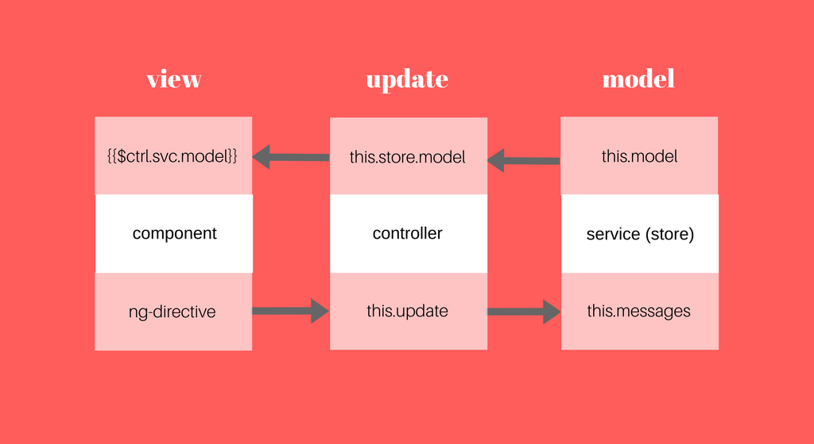

</img>

# ng-elemental
AngularJS application pattern for unidirectional flow, inspired by [Elm](https://www.gitbook.com/book/evancz/an-introduction-to-elm/details) and [Flux](https://facebook.github.io/flux/).

+ Read about [why I created this pattern](https://medium.com/@jochasinga/writing-angular-app-the-elms-way-6e98ad305570).
+ Run [this](https://jsfiddle.net/jchasinga/5pvdtzj7/) and [this](https://jsfiddle.net/jchasinga/wxm8f0L7/) fiddles to see the pattern in play.

## Complexity
To a naive developer, AngularJS can feel like a yarn ball glued to the digest cycle. What makes AngularJS multi-faceted and hard to understand are:
+ unrestricted immutability surface
+ bidirectional data flow
+ lack of clear lines between controllers and services 
+ ubiquitous mutation of state within injected services from any controller
Some or all of these are not problems baked into AngularJS itself, but they are very easy to fall into and not restricted in the framework.

Below are few examples of the entangled messes.

#### Example 1
AngularJS service class which have wide immutability surface and provide too many methods to mutate the state when it should have delegated to a controller.

```javascript

class FooService {
  constructor() {
    this.state = "foo";
  }
  addBaz() {
    this.state = this.state + " baz";
  }
  addBar() {
    this.state = this.state + " bar";
  }
  _addBaz() {
    this.addBaz();
  }
  
  // this goes on ...
}

angular.module("Foo").service("FooService", FooService);

```

#### Example 2
An AngularJS controller using both the service instance and the one attached to its scope to mutate the model state.

```javascript

function FooController ($scope, FooService) {
  $scope.FooService = FooService;
  $scope.addBaz = () => {
    FooService.addBaz();
	
    // or you can do this
    $scope.FooService.addBaz();
  }
}

angular.module("Foo").controller("FooController", FooController);


```

#### Example 3
The DOM can access local `FooService` to call its method or it can call the controller's `addBaz` which wraps around the said method.

```html

<div ng-controller="FooController">
  <!-- Using controller's service instance as API to state -->
  <button ng-click="FooService.addBaz()">Add Baz from Svc</button>

  <!-- Using controller's method as API to state -->
  <button ng-click="addBaz()">Add Baz from Ctrl</button>
</div>

```

## The Elm's Way
Read about [Elm's architecture](https://guide.elm-lang.org/architecture/).


## Model-Update-View
This is an opinionated pattern and not a framework, module, or even a rule. Here is a few things to try going forward with or refactoring your AngularJS code. This pattern is heavily influenced by the Elm architecture (which had also inspired Redux). 

### Model 
+ A service should act as a very thin store or state container, and should be injected into a controller which work as the store manager to provide the API to the state.
+ A service should return a closure of a constructor of the store instead of setting its internal state in a implicitly so that the starting state and messages option can be injected from a controller or unit test.
+ A service’s state should only be updated via an `update` function in the controller, which send a message string to be matched in the service’s messages object and trigger the appropriate pure function. This means the store controller contains only one `update` function.
+ The model should be a single object — a source of truth — grouping all the properties and gets updated and returned as a whole.


```javascript

// ES6 class

class CountStore {
  constructor() {
    return (mod, msgs) => {
      this.model = mod;
      this.messages = msgs;
      return this;
    }
  }
}

// or

function CountStore () {
  return (mod, msgs) => {
    return {
      model: mod,
      messages: msgs
    }
  }
}

```

Returning a closure instead of having a service being initiated implicitly is easier to test as well as encourages delegating the task of initiating the state to some other entity. Note that the service becomes a generic persistent store with zero functionality. What defines each service is the messages object passed in during instantiation. It becomes a descriptive map of the allowed messages any constructor can send to a service to retrieve the new model.

This is an example of a controller initiating a store locally, but it could have fetched a starting state from another service:

```javascript

function CountController (CountStore) {

  let model = 4;
  let messages = {};
  
  // Initiating a myStore service
  this.store = CountStore(model, messages);
}

```

### Update
+ The controller contains only one function, namely `update` (it can be any name), which sends the appropriate message to trigger a pure function in the `messages` object, which maps messages to pure functions.
+ The controller initiates the starting model state and `messages` mapping (or use another service to fetch the data, possibly via `$http`) by injecting them into the service’s constructor.
+ Ideally, the store controller should take care of updating the store service only and should not worry about managing the DOM/component. That should be the component’s controller’s job.

Here is what an update function may look like:

```javascript

function CountController (CountStore) {

  let model = 4;
  let messages = {
    Inc: (model) => {
      return parseInt(model) + 1;
    },
    Dec: (model) => {
      return parseInt(model) - 1;
    },
    Mult: (model, factor) => {
      return parseInt(model) * factor;
    }
  };
  
  // model
  this.store = CountStore(model, messages);
  
  // update
  this.update = (message, model, ...args) => {
    if (message in this.store.messages) {
      this.store.model = this.store.messages[message](model, ...args);
    }
    return this;
  }
}

```
As you can see, the `CountStore` service only holds the model state and messages, and does not responsible for anything else. It is okay to maybe wrap the implementation of the controller's `update` function inside the service as a private method i.e. `_update` as long as it won't be used outside of the controller's `update`.

The `messages` object ideally store pure functions which accept the `model` as the first argument, and use the rest of the arguments in an expression that would return a modified `model`. The `update` function is the only place that gets to mutate the model state in `CountStore` service.

With `update` returning the controller's instance, it is possible to chain update actions together like this:

```html
<button ng-click="$ctrl
                   .update('Inc', $ctrl.store.model)
		   .update('Mult', $ctrl.store.model, 2)
		   .update('CleanUp', $ctrl.store.model)">
  Increment, then times 2
</button>

```
Although it is more ideal for a post hook such as [reattaching an input's value to the model](https://jsfiddle.net/jchasinga/5pvdtzj7/).

### View
+ Components is *strongly* preferred over directives.
+ In a component, a UI-driven action should always call an appropriate function bound to the store’s controller’s `update` function with the right message and argument(s).
+ A component can interpolate the data by binding to the store controller’s model.
+ Only use one-directional bindings (`<`) to let in data or callback from an enclosing store controller’s scope. A component has no business changing anything outside of itself.
+ Bi-directional bindings such as `ngModel` should be used with sparingly. In the example code, it is ditched entirely for a suite of `ngKeydown`, `ngKeyup`, and `$event.key`.

Here is how a component might look like:

```javascript

let Counter = {
    controller: CountController,
    bindings: {},
    template: `
      <div class="todo">
      	<p>{{$ctrl.store.model || 0}}</p>
        <input type="text" ng-model="$ctrl.store.model">
        <button type="button" ng-click="$ctrl.update('Dec', $ctrl.store.model)">
          -
        </button>
        <button type="button" ng-click="$ctrl.update('Inc', $ctrl.store.model)">
          +
        </button>
      </div>
    `
};

```

## Predictability
With this pattern, it is much easier to trace how the model gets mutated as a packaged state. The controller becomes very lean, since all the local functions are refactored and grouped into the messages object as pure functions and let `update` act as a single immutability surface. 

To recap, here is the counter app portraying the three parts, `Model-View-Update`.
https://jsfiddle.net/jchasinga/mfqLt66c/

This one demonstrate a pattern of a store service with a controller serving as its API which enclose a component’s controller’s scope and send in restricted values through the component’s input bindings.
https://jsfiddle.net/jchasinga/wxm8f0L7/

